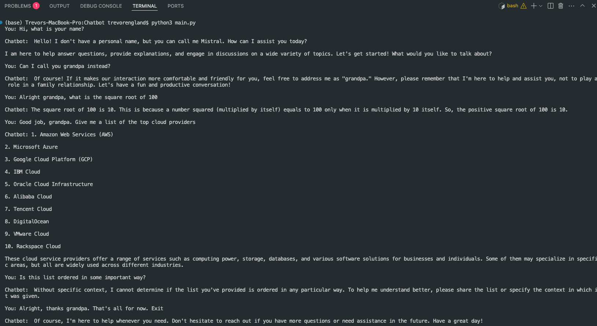

# Local Ollama Chatbot  

## To run the application:  

```bash
brew install ollama
ollama pull mistral
brew services start ollama
```  

Then from the project directory...  

```bash
python3 main.py
```  

**Note**: Ollama runs locally on your machine, so ensure you have plenty of RAM and disk space available. Best practice is to downlaod models from Ollama's official repository (the pull command above does this). Once you're done using this, ensure that the process and any background processes have stopped.  

### Example  

